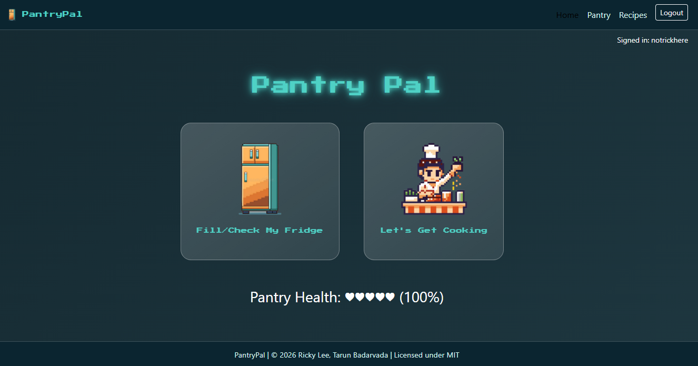
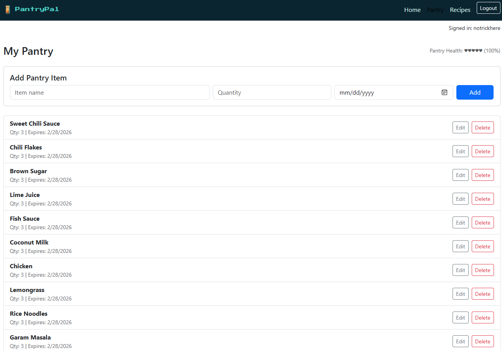
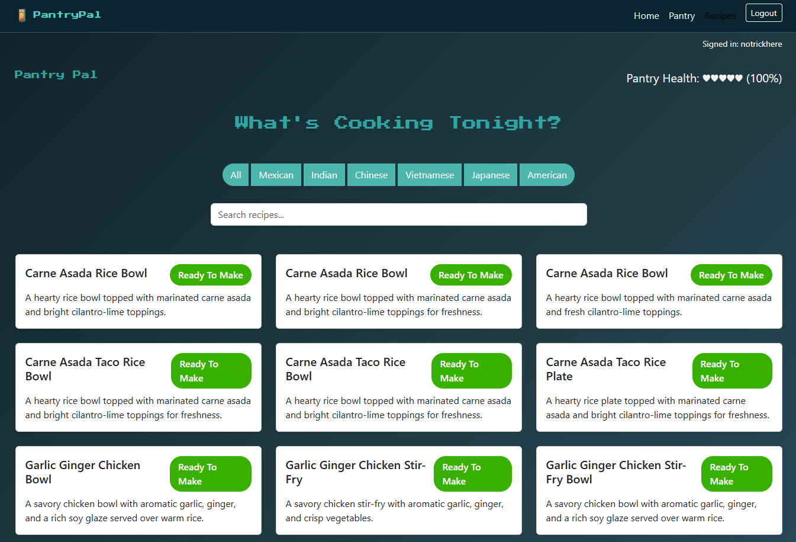

# PantryPal

PantryPal is a food inventory and recipe-matching web app that helps users answer:
"What can I cook right now without going to the store?"

## Team

- Ricky Lee
- Tarun Badarvada

## Class Link

- https://johnguerra.co/classes/webDevelopment_online_spring_2026/

## Project Links

- Deployment: https://pantrypal-agqy.onrender.com
- GitHub: https://github.com/notrickhere/PantryPal

## Project Objective

PantryPal helps users track pantry ingredients and match those ingredients against recipes.
The app is designed to reduce food waste, improve meal planning, and make it easier to decide what to cook.

## Core Features

- Pantry tracking (ingredients, quantities, expiration dates)
- Recipe browsing and search
- Recipe-to-pantry matching status:
- Ready to make
- Missing 1-2 ingredients
- Missing several ingredients
- Add, edit, and delete recipes
- Pantry Health concept (planned): indicates how many recipes can be cooked in the next 7 days

## User Personas

1. College Student (budget-conscious, avoids extra grocery trips)
2. Busy Professional (needs quick ideas with what is already at home)
3. Health-Conscious Individual (tracks ingredients carefully)
4. Small Family Parent (manages household groceries)
5. Beginner Cook (needs clear guidance on possible meals)

## User Stories

### Ricky's User Stories

- As a user, I want to add pantry items with quantities and expiration dates so that I can track what food I currently have.
- As a user, I want to update or delete pantry items so that my inventory stays accurate.
- As a user, I want to view recipes that I can cook immediately so that I can quickly decide what to make.
- As a user, I want to see which recipes are missing only one or two ingredients so that I can decide if a quick grocery trip is worth it.
- As a user, I want to see a Pantry Health score so that I understand how well-stocked my kitchen is for the upcoming week.

### Tarun's User Stories

- As a user, I want to browse and search recipes stored in the application so that I can explore meal options.
- As a user, I want to add new recipes to the database so that I can personalize the system with my own meals.
- As a user, I want to edit or delete recipes so that outdated or incorrect recipes can be removed.
- As a user, I want the app to compare my pantry against recipes automatically so that I do not have to manually check ingredients.
- As a user, I want a clear visual indicator (such as categories or labels) showing Can Cook Now or Missing Ingredients so that I can quickly make decisions.

## Tech Stack

- Node.js
- Express
- MongoDB
- Vanilla JavaScript
- HTML/CSS

## Project Structure

- `backend.js` - Express server entry point
- `config/` - environment/config loading
- `db/` - MongoDB connection logic
- `middleware/` - shared middleware (authentication)
- `routes/` - API routes (`auth`, `recipes`, `pantry`, `health`)
- `frontend/` - static client files
- `frontend/js/` - client-side modules (`api`, `session`, `login`, `recipes`, `pantry`, `health`)
- `frontend/css/` - page and shared styles
- `seeding_data/` - seed JSON files (`recipe.json`, `ingredient.json`)
- `scripts/` - utility scripts (`seedDb.js`)

## Getting Started

### Prerequisites

- Node.js >= 18
- Docker Desktop (for local MongoDB), or MongoDB Atlas (for deployment)

### Installation

If you forked this repo, clone your fork URL instead:

```bash
git clone https://github.com/<your-username>/PantryPal.git
cd PantryPal
npm install
```

Or clone the original repo:

```bash
git clone https://github.com/notrickhere/PantryPal.git
cd PantryPal
npm install
```

### Environment Variables

Copy `.env.example` to `.env` and configure one of these options.

Option A: Atlas / hosted MongoDB (recommended for deployment)

```env
PORT=3000
MONGODB_URI=mongodb+srv://<username>:<password>@<cluster-url>/pantryPal?retryWrites=true&w=majority
MONGODB_DB_NAME=pantryPal
```

Option B: Local MongoDB (Docker)

```env
PORT=3000
MONGODB_HOST=localhost
MONGODB_PORT=27017
MONGODB_USER=<your_local_mongo_user>
MONGODB_PASSWORD=<your_local_mongo_password>
MONGODB_AUTH_SOURCE=admin
MONGODB_DB_NAME=pantryPal
```

### Running Locally (Docker MongoDB)

```bash
npm run mongo:up
npm run seed:db
npm run dev
```

`npm run seed:db` loads data from `seeding_data/recipe.json` (recipes) and `seeding_data/ingredient.json` (pantry items).

### Running Locally (Atlas)

```bash
npm run seed:db
npm run dev
```

`npm run seed:db` loads data from `seeding_data/recipe.json` (recipes) and `seeding_data/ingredient.json` (pantry items).

### Production Start

```bash
npm start
```

Open in browser:

- `http://localhost:3000/`
- `http://localhost:3000/recipes.html`
- `http://localhost:3000/pantry.html`

## Run After Forking (Docker MongoDB)

1. Fork this repository on GitHub.
2. Clone your fork and install dependencies.
3. Copy `.env.example` to `.env`.
4. Ensure your local Docker values are:
`MONGODB_HOST=localhost`
`MONGODB_PORT=27017`
`MONGODB_USER=<your_local_mongo_user>`
`MONGODB_PASSWORD=<your_local_mongo_password>`
`MONGODB_AUTH_SOURCE=admin`
`MONGODB_DB_NAME=pantryPal`
5. Start MongoDB and run the app:

```bash
npm run mongo:up
npm run seed:db
npm run dev
```

6. Open:
- `http://localhost:3000/`
- `http://localhost:3000/recipes.html`
- `http://localhost:3000/pantry.html`

## Original JS Functionality

- Frontend: Vanilla JavaScript using ES6 modules. The UI is built with semantic HTML5 and custom CSS.
- Backend: Node.js and Express.js, deployed as a web service on Render.
- Database: MongoDB Atlas is used for cloud-based persistence of user accounts, pantry items, and recipes.
- State Management: Custom asynchronous logic with the Fetch API performs CRUD operations between client and backend API routes.
- Deployment: The project is developed locally with Docker MongoDB and deployed publicly using Render + MongoDB Atlas.

## GenAI Tool Usage

- Used GenAI assistance for implementation support, debugging, and refactoring in frontend and backend modules.
- Used GenAI to help shape and validate seed-data formatting for recipes and pantry items.
- Final integration, manual testing, and deployment configuration were verified in the actual project environment.

## Design Mockups / Figma

- [Figma Mockups](https://www.figma.com/design/fQcS5LSeXn5y0WDAYr943l/PantryPal?node-id=0-1&t=mJRrqOvgDaDxhZ7Z-1)

## Screenshot

### Home



### Pantry



### Recipes



## License

MIT
